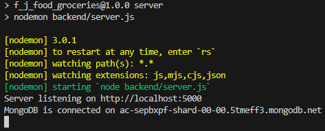

# F&J POPULAR MEATS AND GROCERY

Project Description:
F&J POPULAR MEATS AND GROCERY needs a website to meet different customers needs. The website should be able to work on cross-platforms.

#Software Architecture:
This project uses the MVC software architecture pattern.
Models- This represents the basic user information.
Views - This renders and displays user information based on the models. This part does not handle the logic however.
Controllers - This controls the logic for the user based on the model information. It listens to events from the views layer and executes the appropriate logic for that function.

#Project Setup

How to start the project from the backend:

Step 1:
Ensure that you have node.js installed as a system variable on your computer.
Tutorial: https://www.freecodecamp.org/news/node-version-manager-nvm-install-guide/
Follow this tutorial and install node.js v18.17.1

Step 2:
Navigate to whatever text editor you use and run the command npm install. This should download the node_modules folder into the project directory as well as install the necessary dependencies to run the project.

Step 3:
After the project has successfully been installed, type in the commands:

Step 4:
If the project is working correctly, you should see a display showing the following:

Following all these steps should allow you to have the project running locally on your machine.

#Tips
-When you make a change locally to the project on the machine and want to push the code to Github, push it to a branch first instead of the main repository.

-You're free to make changes as you please on the code from your local machine, but don't try to overwrite someone's code without asking first. If you think you have a better implementation try pushing it to the branch and we discuss whether or not to use which part.

#Project folders description

package.json:
This shows the dependencies installed to the project.

.env:
This stores sensitive information that we do not want the client to see.

.gitignore:
This is where we store files we do not want to push to github

unit_tests:
This is where we write tests to see if our code is working as intended.

routes:
This is where we store our POST, GET, UPDATE, DELETE requests for the client as well as the different routes for the customer.

Models:
Customer
Product

Controllers:
Cart
Customer
Product

Database:
MongoDB

Programming language
JavaScript
Nodejs(Javascript backend framework)
Express
Reactjs(Javascript frontend framework)

Developers:
Jemoi Johnson,
Shamar Malcolm,
Rhonaldo Foster,
Hayden Byfield,
Liandra Greyson,
Joel Plummer
